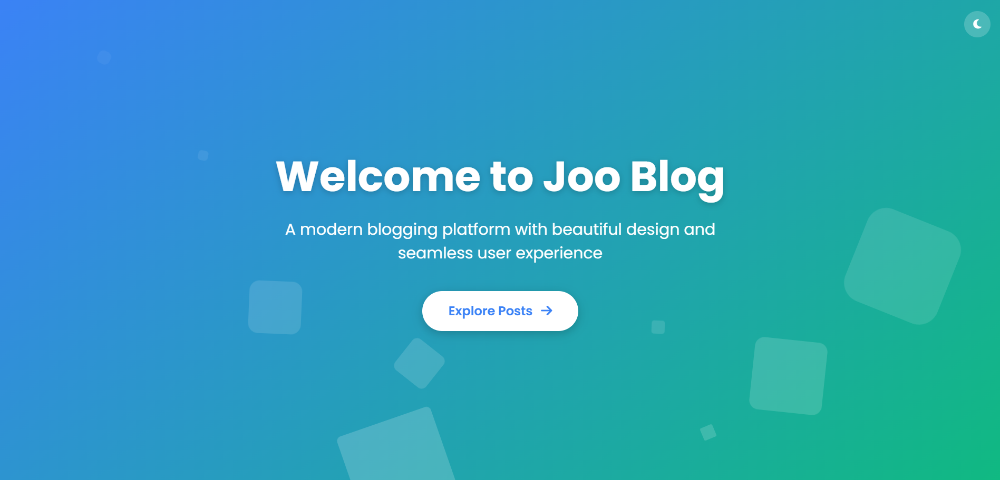

# Welcome to Joo Blog 📝


Joo Blog is a simple Laravel-based blogging system built to practice and demonstrate CRUD (Create, Read, Update, Delete) operations.  
This project is part of my Laravel learning journey and serves as a hands-on implementation of key backend concepts.

## 🔧 Features

- Create new blog posts
- View a list of all blog posts
- Edit existing posts
- Delete posts
- Clean and structured codebase using Laravel MVC pattern

## 📚 Purpose

The main goal of Joo Blog is to:

- Practice CRUD operations in a real-world scenario
- Strengthen understanding of Laravel's routing, controllers, models, and views
- Gain experience with Blade templating and form handling in Laravel

## 🚀 Technologies Used

- Laravel Framework
- PHP
- Blade (Laravel's templating engine)
- MySQL (or any SQL-based DB)
- Bootstrap/Tailwind (for basic UI, optional)

## ✅ How to Use

1. Clone the repo:
   ```bash
   git clone https://github.com/Yousefa7medmaher/Laravel-Practice-and-Projects.git
